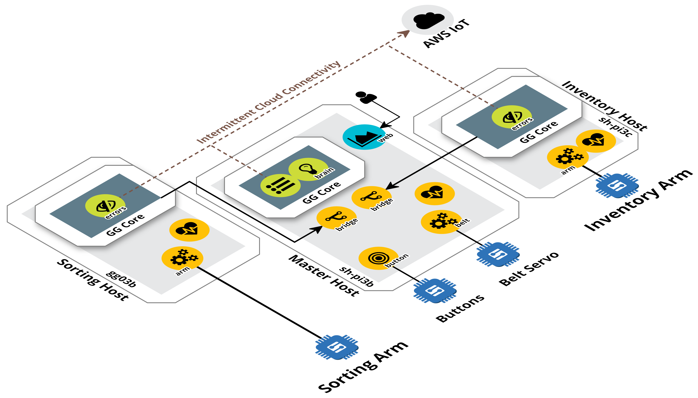

## The Greengrass mini-fulfillment center example 

At re:Invent 2016 AWS Greengrass was introduced to the world. This miniature 
fulfillment center demonstration was used to display what could be done with 
Greengrass when announced. It has since been upgraded to use the publicly available 
version of [Greengrass](https://aws.amazon.com/greengrass/) v1.
 
A [video](https://youtu.be/XQQjX8GTEko?t=27m27s) was taken of the completed and 
operational Greengrass-based miniature fulfillment center, a.k.a. "dual robot arm demo" 
in action at re:Invent. Since re:Invent this demo and example has continued to 
evolve. It has been the seed for [other demos](https://youtu.be/dpatdO2uPCA) and 
now supports Greengrass [discovery](http://docs.aws.amazon.com/greengrass/latest/developerguide/gg-discover-api.html) 
capabilities. 

The artifacts, example code, and instructions to construct this demo are 
available in this repository as an example. We look forward to seeing what 
you'll do with it.

#### Directory Structure and Noteworthy Files
```
aws-greengrass-mini-fulfillment/
  +- docs/
  |  +- BOM.md         -- the bill of materials necessary for construction
  |  +- CONSTR.md      -- instructions for physical construction (TODO)
  |  +- INSTALL.md     -- instructions for software provisioning and install
  |  +- OPERATE.md     -- instructions for operation of the demo
  |  +- TIDBITS.md     -- tiny pieces of setup information that might be helpful
  |  +- TROUBLE.md     -- troubleshooting of install and operation
  |
  +- groups/
  |  +- cert_setup.py  -- generates local certificates used by Greengrass groups 
  |  +- group_setup.py -- provisions and deploys example Greengrass groups 
  |  +- servo_setup.py -- prepares the servo communication code for example use  
  |  |
  |  +- arm/           -- the code and config necessary for an arm host
  |  |  +- ggd/        -- the Greengrass Devices that will be run on the Host
  |  |  |  +- servo/   -- the servo communications libraries 
  |  |  +- inv_arm/    -- the specific config and certs for the `inv_arm` group 
  |  |  +- sort_arm/   -- the specific config and certs for the `sort_arm` group
  |  | 
  |  +- lambda/        -- the Lambda functions used in the Greengrass groups
  |  |
  |  +- master/        -- the directory of the `master` Greengrass group 
  |     +- certs/      -- the group AWS IoT and local certs to be copied to Core
  |     +- ggd/        -- the Greengrass Devices that will be run on the Host
  |        +- certs/   -- the client certs used by GG devices
  |        +- flask/   -- where the web GG device gets files to serve
  |        +- servo/   -- the servo communications libraries 
  |
  +- models/           -- the models used to 3D print components of this demo
  +- LICENSE
  +- README.md -- this file
  +- requirements.txt
```

After following the [installation instructions](docs/INSTALL.md), each directory 
contains all the files necessary to support one of the three Demo groups' hosts. 
There are three Greengrass Groups named: 

| Group | Host Name | Description |
| :---: | :---: | :--- |
| `inv_arm` | `inv_arm-pi` | contains the Inventory Arm devices and the Inventory Arm Core |
| `master` | `master-pi` | contains both the Conveyor Belt devices and the Master Core |
| `sort_arm` | `sort_arm-pi` | contains the Sorting Arm devices and the Sort Arm Core |

The demo behavior is broken into the concept of a series of simple control stages 
organized by Group. Those stages are:

| Group | Control Stages |
| :--- | :--- |
| **Inventory Arm** | `... > Home > Finding > Pickup > Shipping > Home > ...` |
| **Master** | `..conveyor direction..` |
| **Sorting Arm** | `... > Home > Finding > Pickup > Sorting > Home > ...` |

As shown in the video above, even with these simple stages the interaction between 
the three Groups displays complex, cohesive, and coordinated behaviors.

This is possible because the whole system is modeled as a collection of micro-services. 
Those micro-services then leverage high-speed local messaging to enable communication 
within and between groups, as well as transactional state control using local device 
shadows. 

The high-level, local architecture of the demo is:


#### Master/Conveyor Host
There are six processes on this host:
- the Master Greengrass Core
- the [`heartbeat`](groups/master/ggd/heartbeat.py) Greengrass Device (GGD) process
- the [`bridge`](groups/master/ggd/bridge.py) GGD process
- the [`belt`](groups/master/ggd/belt.py) GGD process -- manages the conveyor belt servo
- the [`button`](groups/master/ggd/button.py) GGD process -- manages the button box's red, green, and white control buttons
- the [`web`](groups/master/ggd/web.py) GGD process

Within the Master Core, these are the Lambda functions:
- [`MasterErrorDetector`](groups/lambda/MasterErrorDetector/error_detector.py) -- this function monitors local telemetry and detects any error states
- [`MasterBrain`](groups/lambda/MasterBrain/master_brain.py) -- this function monitors the fabric of telemetry coming from the 
  bridges and the local GGDs. This function will decide what to do with respect 
  to current telemetry and errors in the system

There is a web visualization on this host. If one browses to: `<master_ip>:5000` a 
visualization that reads data from the Master Core can be seen. 

#### Inventory Arm Host
There are three processes on this host:
- the Inventory Arm Greengrass Core
- the [`heartbeat`](groups/arm/ggd/heartbeat.py) Greengrass Device (GGD) process
- the [`arm`](groups/arm/ggd/arm.py) GGD process

Within the Inventory Arm Core, this is the Lambda function:
- [`ArmErrorDetector`](groups/lambda/ArmErrorDetector/error_detector.py) -- this function monitors local telemetry and detects any error states

#### Sorting Arm Host
There are three processes on this host:
- the Sorting Arm Greengrass Core
- the [`heartbeat`](groups/arm/ggd/heartbeat.py) Greengrass Device (GGD) process
- the [`arm`](groups/arm/ggd/arm.py) GGD process

Within the Sort Arm Core, this is the Lambda function:
- [`ArmErrorDetector`](groups/lambda/ArmErrorDetector/error_detector.py) -- this function monitors local telemetry and detects any error states


#### Noteworthy Files
There are some noteworthy files in the repository that centralize a fair amount 
of work around the instantiation of this demonstration.
- `groups/group_setup.py` – performs all provisioning of each host's Greengrass Group. 
This file has commands that are useful when instantiating this demo and that demonstrate the use of the Greengrass REST APIs.
    - `create <group_type> <config_file>` – creates a Greengrass Group for a given 
    group type and configuration file. Also stores all of the provisioning 
    artifacts (i.e. `GroupID`, `CoreDefinitionId`, etc.) in the local configuration file.
    - `deploy <config_file>` – deploys a previously provisioned Greengrass Group
    - `clean-all <config_file>` – cleans up the entirety of a Greengrass Group 
    and the locally stored provisioning artifacts.
- `groups/servo_setup.py` – prepares the servo manufacturer's communication library 
for use on a Raspberry Pi with the Raspbian OS.

## DIY
If you'd like to build a copy of this demo yourself you'll want to read both 
the [installation instructions](docs/INSTALL.md) and the 
[construction instructions](docs/CONSTR.md). Please share any feedback you have 
or questions you run into here as [Issues](https://github.com/awslabs/aws-greengrass-mini-fulfillment/issues).

## Special Thanks
[Brett Francis](https://github.com/brettf) and [Todd Varland](https://github.com/toddvarland) would like to thank the following. Without their 
help and existence we simply would not have made this demo.

> **The Francis Family, The Varland Family, [gg-group-setup](https://github.com/awslabs/aws-greengrass-group-setup), 
[ROBOTIS](https://github.com/ROBOTIS-GIT/DynamixelSDK), [Servode](https://github.com/brettf/servode), 
Pretty Lights, Sigur Ros, Flume - Insanity, Amazon.com, HBO Silicon Valley, The [Greengrass](https://aws.amazon.com/greengrass/) Developers**
