# AWS Mini Fulfillment Center Construction

Welcome to the AWS Mini Fulfillment Construction Documentation. 

## Construction Instructions

Overall the process is:
1) acquire parts from the [Bill of Materials](BOM.md)
1) print 3D parts
1) assemble each [arm](#the-arm)
1) assemble [control box](#the-control-box)
1) assemble [conveyor](#the-conveyor)
1) follow [software installation](INSTALL.md)
1) push green button

## The Arm
The quickest way to assemble the various parts that form a complete robot arm is 
to assemble them in four separate sections and combine them at the intersection 
points. The arm's four main sections are in this image:

### The Shoulder

| Image | Instructions | 
| :--- | :--- |
| 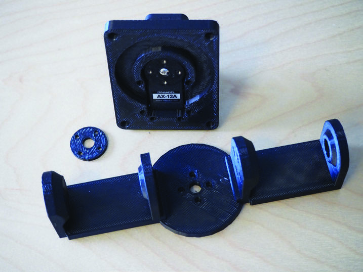 | Connect the Servo to the large square spacer using six N1 bolts and six S3 screws. |
| 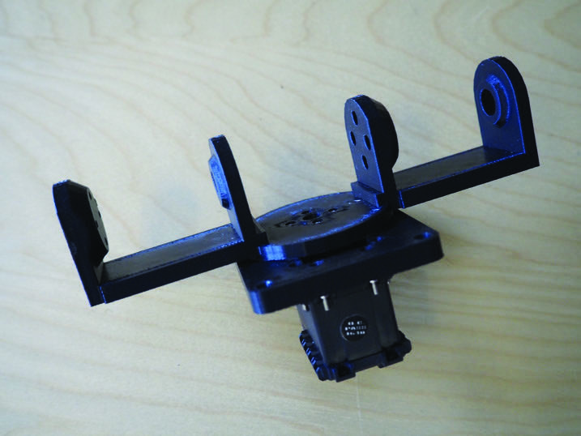 | Attach the shoulder piece to the servo fly-wheel. Make sure to include the small spacer between the fly-wheel and shoulder piece. |
| 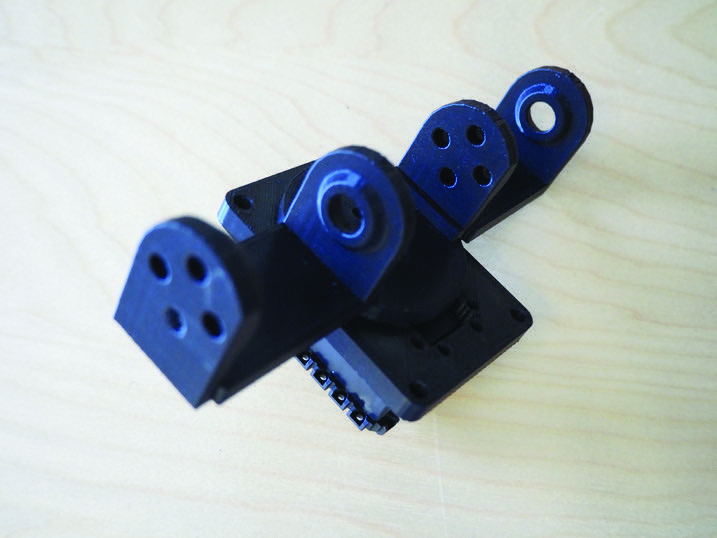 | When you have completed it, the shoulder should be pointing so that the four holes are on the left side. |

### The Claw

| Image | Instructions | 
| :--- | :--- |
| 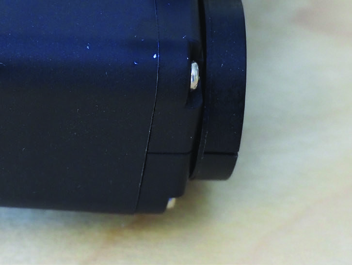 | In general, when connecting a servo to any other part, start with the fly-wheel in the initial state, indicated by the aligned lines in the plastic. |
| 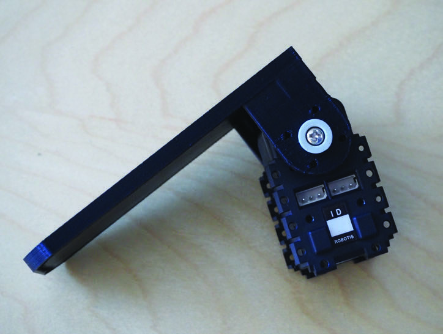 | Position the servo fly-wheel so that it is pointing downward and use four S3 screws to connect the right clamp to the fly-wheel. |
| 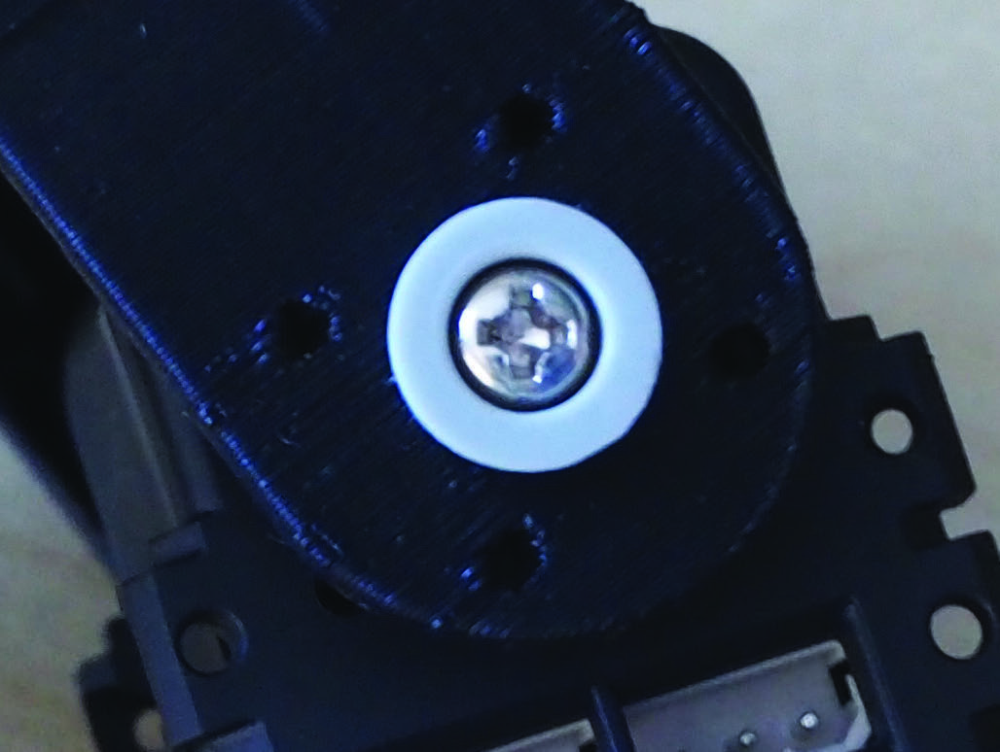 | On the top side, you’ll need to insert the BU washer through the center hole on the clamp and fasten it to the servo using an S4 screw. |
| 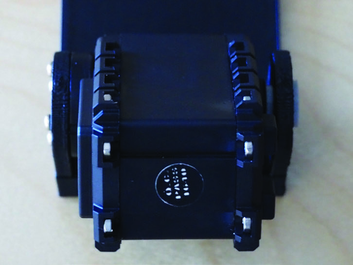 | Position the Tibia assembly like shown so that the fly-wheel is pointing to the left and pre-insert six N1 bolts as shown. |
| 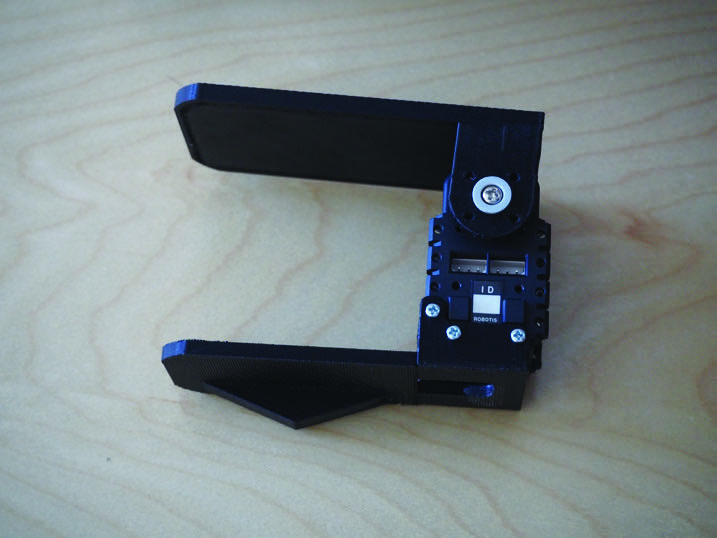 | Return the assembly to the original position and attach the left clamp to the servo using six S3 screws. Be sure the N1 bolts line up. |
| 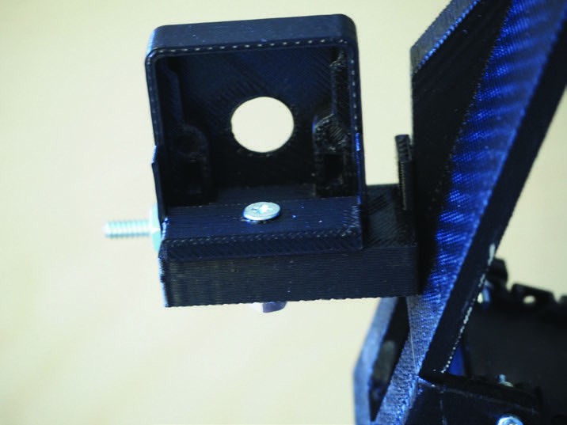 | Attach the two camera housing pieces together using an `N` nut and S3 screw. |
| 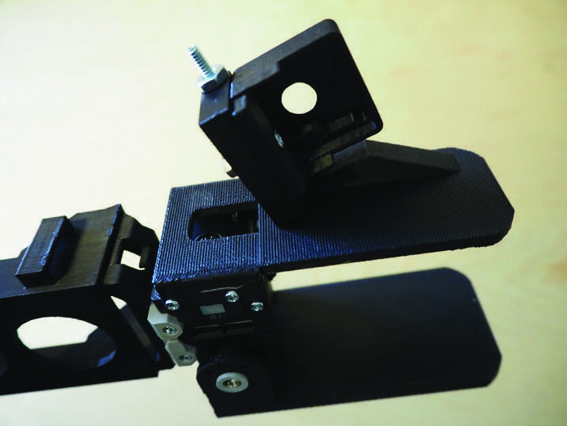 | Then, use any 2” long screw and bolt to attach the camera housing to the left clamp. |
| 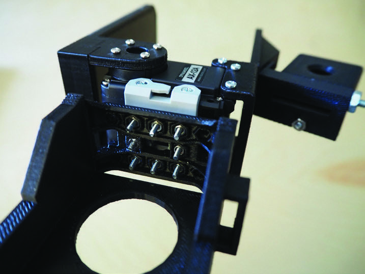 | Place eight N1 bolts into the slotted holes at the flat end of the Tibia and fasten the FP servo mount using eight S3 screws. |
| 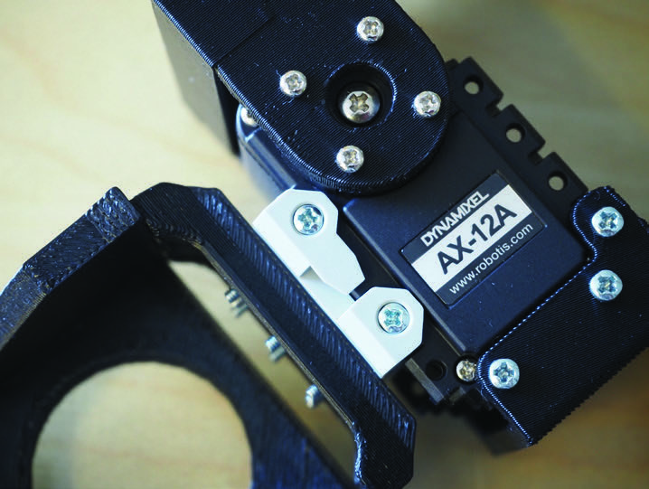 | Attach the Claw to the `FP04` mount as shown in this photo. Remember to place four N1 bolts into the servo slots accordingly and fasten  with S3 screws. |
| 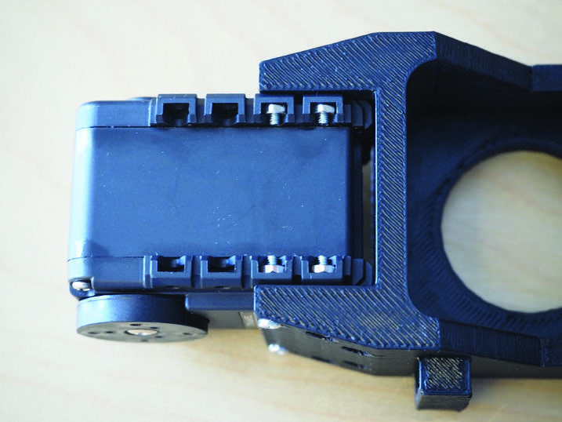 | Position the servo at the bottom end of the Tibia as shown so the fly-wheel faces the side with the cable slots. Insert twelve N1 bolts into the servo and fasten with S3 screws. |

### The Femur

| Image | Instructions | 
| :--- | :--- |
| 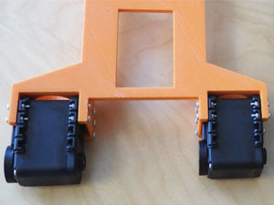 | Begin the Femur assembly by placing the the piece so that the flat side with the rectangular cut-outs are on top. The servo fly-wheels should be pointing to the left. |
| 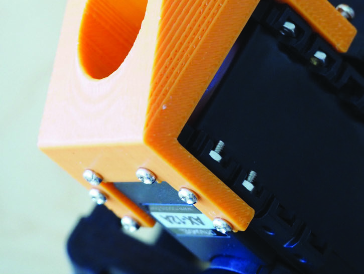 | Each servo will be connected to the Femur using six S3 screws on the outer side and five on the inner side. Be sure to pre-insert the N1 bolts into the corresponding servo slot. |
| 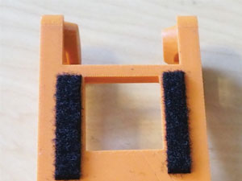 | Attach two strips of velcro for the Raspberry Pi to mount onto the Femur. |

### The Base

| Image | Instructions | 
| :--- | :--- |
| 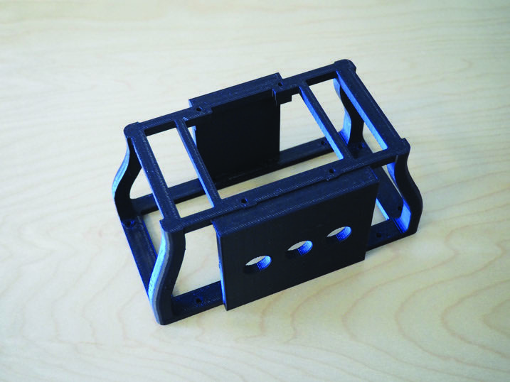 | The base’s front side is marked by the 3 holes, and the back with the flat side. The base will contain a power converter that is attached with velcro. |
| 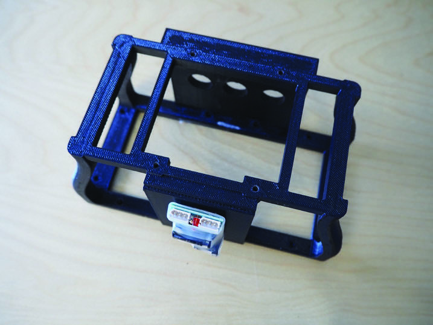 | Attach the `SMPS2DYNAMIXEL` power converter mounted to the back with the three pins facing up. *Note: there are both three pins and four pins on the power converter.* |
| 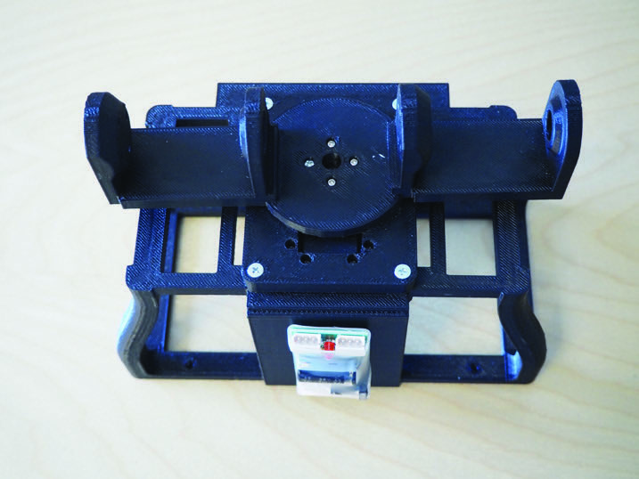 | Using four M3x16mm Flat head screws (equal to SB screws but flat head), mount the shoulder assembly to the base. Flat heads are essential or the shoulder's rotation will be blocked. |

### Connect at the Joints

| Image | Instructions | 
| :--- | :--- |
|  | In general, when connecting a servo to any other part, start with the fly-wheel in the initial state, indicated by the aligned lines in the plastic. |
|  | Attach the Femur assembly to the Shoulder/Base with the fly-wheel on the servo facing to the left with S3 screws. Use BU-WA washers and an SB screw to fasten the other end of the servo. |
| 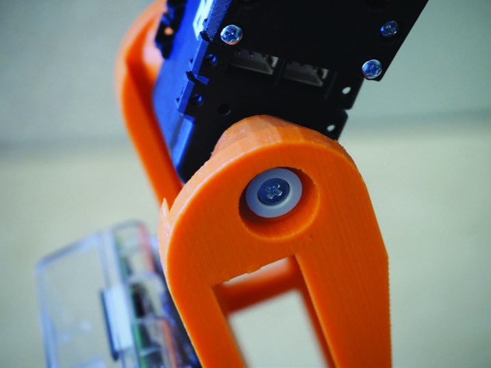 | Use one BU-WA washer and SB screw to attach the bottom (or right side when viewing the arm from the back). |
| 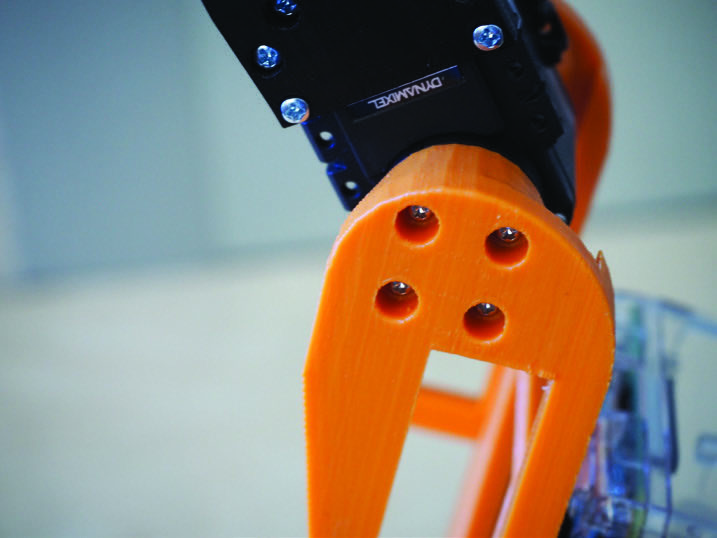 | Use four S4 screws to fasten the Claw assembly to the Femur assembly. *Note: the S4 screws are needed due to the extra thickness of the Femur.* |
| 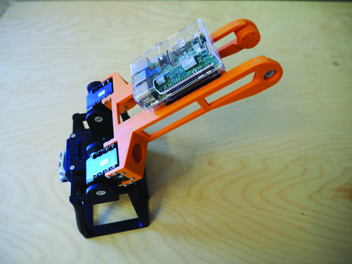 | Attach the Raspberry Pi to the Femur using the velcro strips. |
|  | When attaching the Claw to the Femur, ensure the direction of the claw is as shown. |

### Cables and Power

| Image | Instructions | 
| :--- | :--- |
| 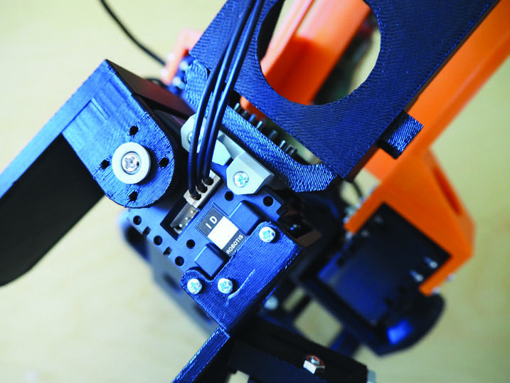 | The servos are daisy-chained using the 3P 200mm Robot Cable. Follow the images and connect as shown. |
| 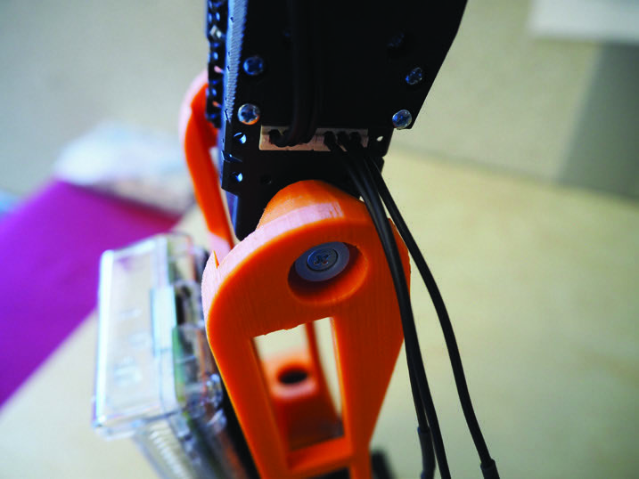 | The cable will usually connect the previous servo on the left, and daisy chain out from the right slot. |
| 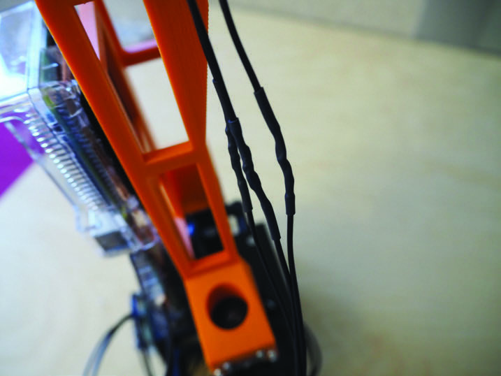 | Between the Elbow servo and Shoulder, you’ll need to splice a longer (by 3”) cable. |
| 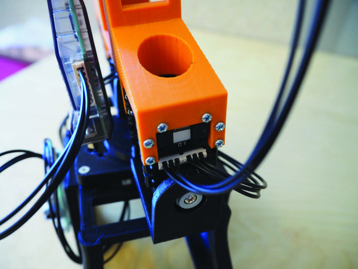 | From the Elbow, connect to the right servo on the left (`in`) slot and connect the right (`out`) slot to the servo on the left. |
| 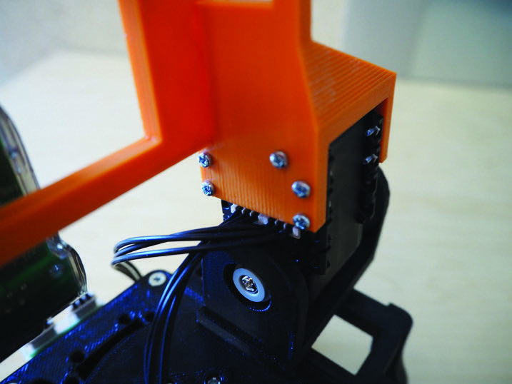 | From the right slot, connect to the bottom servo on the left slot. The left servo must be the one connected to the bottom. |
| 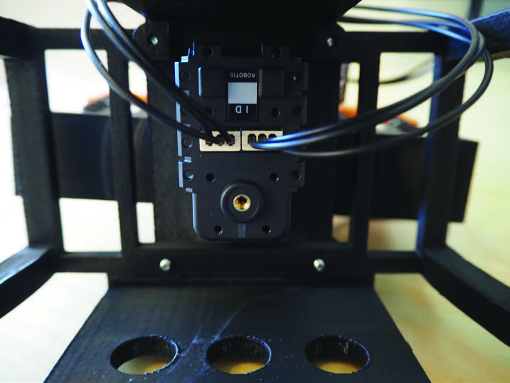 | The last servo in the daisy chain will connect to the the left servo using the left pin slot. Using the right pin slot connect to the power adapter. |
| 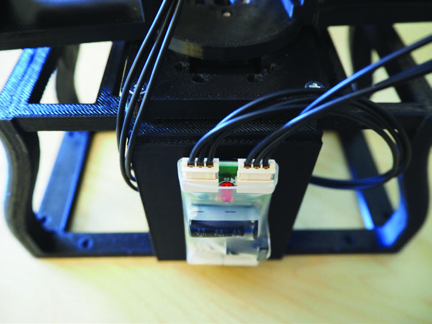 | The power adapter receives the bottom servo connection in the left slot and goes to the serial adapter from the right slot. |
| 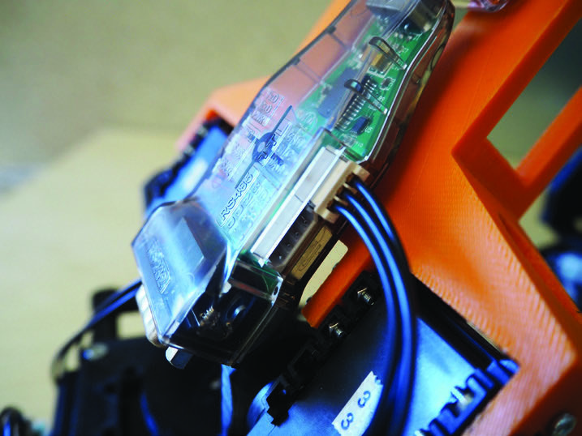 | There is only one three pin slot on the serial adapter that is connected to the USB port on the Raspberry Pi. |
|  | Note that the switch must be in the up position if using the three pin slot. |

## The Control Box
    <TBD>

## The Conveyor
    <TBD>

> Note: The conveyor used in this example was inspired by [this fine work](http://www.instructables.com/id/DIY-Conveyor-belt/).